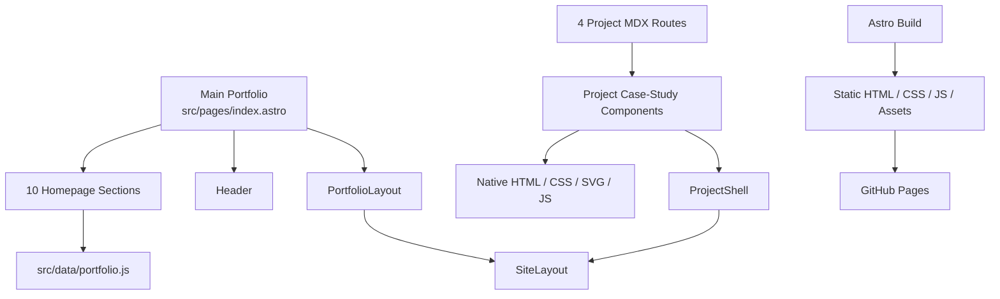

# Manoj Pant — Senior Product Manager Portfolio

A production-ready, static product-management portfolio built with **Astro, MDX, SCSS/CSS, semantic HTML, SVG, and lightweight JavaScript**.

The site presents a main portfolio plus four detailed product case studies covering **FinTech / Digital Banking, Healthcare, Sales Intelligence / Field Force Optimization, and Telecom Analytics**.

**Live portfolio:** https://mapant.github.io/  
**Repository:** https://github.com/mapant/mapant.github.io

---

## Overview

This repository contains Manoj Pant's interactive product portfolio. It is designed as a case-study-driven product experience rather than a conventional résumé site.

The portfolio currently contains **five generated HTML routes**:

| Page | Route |
|---|---|
| Main Portfolio | `/` |
| Integrated Channels Suite | `/projects/integrated-channels/` |
| Ayu DocConnect | `/projects/ayu-docconnect/` |
| Ayu Sales Intelligence & Field Force Optimization | `/projects/ayu-sales-intelligence/` |
| Telecom Analytics & Cost Optimization | `/projects/telecom-cost-optimization/` |

Each route is a long-form, ten-section product narrative with anchored navigation and purpose-built visual storytelling.

The website is statically generated. Product dashboards, diagrams, mobile interfaces, workflows, charts, and operating models shown in the case studies are authored portfolio illustrations and demonstrations; they are not live connections to banking, healthcare, telecom, hospital, CRM, analytics, or customer-production systems.

---

## Portfolio Structure

### Main Portfolio

The homepage is organized into ten sections:

1. **Overview**
2. **Ecosystem**
3. **Challenge**
4. **Strategy**
5. **PM Scope**
6. **Product Metrics**
7. **Portfolio**
8. **Tech & Data**
9. **Outcomes**
10. **Connect**

The homepage introduces Manoj's product-management experience, operating model, product strategy approach, product metrics framework, technology/data exposure, representative outcomes, and the four case studies.

---

## Featured Case Studies

### 1. Integrated Channels Suite

**Domain:** FinTech / Digital Banking  
**Route:** `/projects/integrated-channels/`

A product case study for a configurable digital-banking suite for banks and NBFCs.

The case study covers:

- a **12-application** banking product portfolio
- lending and credit workflows
- payments and cards
- compliance and KYC
- reconciliation
- financial-control modules
- configurable institution-specific workflows
- integration-led banking architecture
- regulatory and operational controls
- deployment and adoption considerations
- product-management responsibilities
- measurement and outcome frameworks

The 12 represented applications are:

- Audit
- FAM
- GST
- LOS–LMS
- CMS
- Shares
- PM Schemes
- CIBIL
- Reconciliation
- AML–KYC
- Treasury
- DMS & CKYC

The Ecosystem and Portfolio sections can launch project-specific product workspaces. These are static portfolio demonstrations backed by authored local data and browser-side interaction logic; they do not call banking APIs.

---

### 2. Ayu DocConnect

**Domain:** Healthcare / Doctor Engagement / Patient Journey  
**Route:** `/projects/ayu-docconnect/`

A healthcare product case study focused on doctor engagement, patient referrals, patient-journey visibility, incentives, network growth, and integrated healthcare services.

The current implementation includes:

- doctor-referral workflows
- patient journey tracking
- referral → OPD → IPD → discharge visibility
- doctor engagement and retention concepts
- incentives and earnings
- doctor network capabilities
- ambulance services
- Google Business integration concepts
- product metrics and measurement
- native mobile-interface mockups
- product-management lifecycle
- architecture and technology views
- pilot outcomes
- product-leadership narrative

The Product Metrics section uses a **Doctor & Referral Measurement Framework** covering:

- Doctor Activation
- Active Doctor Usage
- Repeat Referral Rate
- Referral Conversion
- Journey Visibility
- Payout Turnaround
- Referral → OPD → IPD → Discharge → Follow-up
- Doctor Lifecycle & Retention
- Workflow Adoption & Operational Health
- Product Decisions Driven by Measurement

All phones, dashboards, diagrams, architecture layers, and product surfaces are native portfolio illustrations rather than a connected healthcare application.

---

### 3. Ayu Sales Intelligence & Field Force Optimization

**Domain:** Healthcare Sales / Field Force / Sales Intelligence  
**Route:** `/projects/ayu-sales-intelligence/`

A field-sales operating and intelligence case study designed around better prospect discovery, visit planning, travel efficiency, territory execution, referral-agent management, field visibility, and measurable sales operations.

The ten sections cover:

- prospect intelligence
- smart visit planning
- field-force ecosystem
- business challenges
- data-led product strategy
- PM ownership and delivery
- measurement framework
- product capability portfolio
- product/data architecture
- pilot outcomes
- product leadership

Representative capabilities include:

- Prospect Intelligence & Assignment
- Beat Plan & Visit Prioritisation
- Agent & Prospect Visit Management
- Location & Travel Intelligence
- Referral-Agent Movement
- Sales Insights & MIS
- Agent Lifecycle & Verification

The project also includes seven native detail dialogs connected to the capability cards.

The Sales Intelligence measurement framework covers:

- Prospect Quality & Acquisition
- Field Coverage
- Visit Efficiency
- Conversion
- Field Productivity
- Product Adoption / Usage

The case study is static and explanatory: the illustrated maps, field routes, phone experiences, analytics, and workspaces are not live tracking or production sales systems.

---

### 4. Telecom Analytics & Cost Optimization

**Domain:** Telecom / Analytics / Cost Optimization  
**Route:** `/projects/telecom-cost-optimization/`

A telecom analytics case study focused on connecting network assets, geographic context, operational data, and financial information to improve decision-making.

The case study covers:

- asset identity
- network and source-data convergence
- location/spatial context
- finance / CapEx / OpEx context
- semantic data modeling
- trustworthy joins
- analytics architecture
- rollout strategy
- cost-intelligence visualization
- governance, freshness, and data quality
- analytics maturity

The ten sections are:

1. Overview
2. Ecosystem
3. Challenge
4. Strategy
5. PM Scope
6. Architecture
7. Delivery
8. Product Explorer
9. Impact
10. Product Leadership

The Product Explorer is a static authored dashboard-like portfolio illustration. Filters, bars, markers, and map elements are presentational and are not connected to a live telecom-data platform.

---

## Architecture

The site uses Astro's static-site generation model.



### Rendering model

- Astro renders page/component frontmatter at build time.
- MDX files serve as lightweight project-route adapters.
- Project copy and content arrays are primarily stored in Astro components.
- SCSS controls layout, visual systems, responsive rules, diagrams, and card geometry.
- Inline SVG is used for many icons, diagrams, connectors, charts, maps, and illustrations.
- Lightweight browser JavaScript handles section navigation and project-specific interactions.
- There is **no React/Vue/Svelte hydration**, server-side application runtime, CMS, database, authentication system, or production product API behind the portfolio.

---

## Technology Stack

### Website stack

| Layer | Technology |
|---|---|
| Static site framework | Astro 7 |
| Content route adapters | MDX |
| Styling | SCSS / CSS |
| Structure | Semantic HTML |
| Layout | CSS Grid / Flexbox |
| Icons / diagrams | Inline SVG / CSS |
| Interaction | Vanilla JavaScript |
| Build output | Static HTML / CSS / JS |
| Hosting | GitHub Pages |
| CI/CD | GitHub Actions |

Current dependency baseline documented in the repository:

- **Astro:** 7.3.5
- **@astrojs/mdx:** 8.0.2
- **Sass:** 1.105.1
- **Node engine:** `^22.12.0 || ^24.0.0`
- **GitHub Actions build runtime:** Node 22.12.0

The local environment used during repository verification was Node 24.21.0.

### Important distinction

Technology names shown **inside the portfolio case studies** describe product architecture, professional exposure, analytics concepts, or delivery tooling. They are not automatically dependencies of this website.

For example, a case-study card may mention PostgreSQL, Python, REST APIs, JIRA, Figma, Google Analytics, Mixpanel, Power BI, Tableau, banking APIs, maps, WhatsApp, or similar platforms without the portfolio website itself connecting to those systems.

---

## Repository Layout

```text
.
├── .github/
│   └── workflows/
│       └── deploy.yml
│
├── docs/
│   ├── references/
│   │   ├── main-portfolio-reference.md
│   │   ├── integrated-channels-reference.md
│   │   ├── ayu-docconnect-reference.md
│   │   ├── ayu-sales-intelligence-reference.md
│   │   └── telecom-reference.md
│   ├── ayu-docconnect-validation.md
│   ├── ayu-sales-intelligence-validation.md
│   └── github-pages-root-migration.md
│
├── public/
│   ├── profile/
│   ├── ics/
│   ├── ayu-docconnect/
│   └── ayu-sales-intelligence/
│
├── src/
│   ├── components/
│   │   ├── sections/
│   │   ├── ProjectShell.astro
│   │   ├── IntegratedChannelsCaseStudy.astro
│   │   ├── IntegratedChannelsPresentation.astro
│   │   ├── DocConnectCaseStudy.astro
│   │   ├── AyuSalesIntelligenceCaseStudy.astro
│   │   ├── SalesIntelligencePresentation.astro
│   │   ├── SalesIntelligenceManagement.astro
│   │   ├── SalesIntelligenceWorkspaces.astro
│   │   ├── SalesIntelligenceOutcomes.astro
│   │   └── NokiaAnalyticsCaseStudy.astro
│   │
│   ├── data/
│   │   └── portfolio.js
│   │
│   ├── layouts/
│   │   ├── SiteLayout.astro
│   │   └── PortfolioLayout.astro
│   │
│   ├── pages/
│   │   ├── index.astro
│   │   └── projects/
│   │       ├── integrated-channels.mdx
│   │       ├── ayu-docconnect.mdx
│   │       ├── ayu-sales-intelligence.mdx
│   │       └── telecom-cost-optimization.mdx
│   │
│   ├── scripts/
│   └── styles/
│
├── astro.config.mjs
├── package.json
├── package-lock.json
└── README.md
```

The repository also contains some historical/unused components and style files. They are not necessarily part of the active route graph. Before editing a similarly named file, trace the actual import path used by the live route.

---

## Shared Components

### `SiteLayout.astro`

Owns the shared HTML document structure and metadata.

### `PortfolioLayout.astro`

Wraps the main homepage inside `SiteLayout`.

### `Header.astro`

Provides the homepage-specific identity, section navigation, and project CTA.

### `ProjectShell.astro`

Shared by the four detailed case studies and responsible for:

- profile/header
- project section navigation
- active-section observation
- CTA behavior
- optional shared footer
- shared case-study shell behavior

A change to `ProjectShell` can affect all four case-study routes, so project-specific visual fixes should stay scoped to their project components/styles whenever possible.

---

## Navigation

### Homepage anchors

The homepage uses:

```text
#overview
#ecosystem
#challenge
#strategy
#scope
#metrics
#portfolio
#tech
#outcomes
#connect
```

### Project anchors

Project routes can use their own IDs. For example, the main healthcare/fintech projects use anchors such as:

```text
#overview
#ecosystem
#challenge
#strategy
#pm-scope
#product-metrics
#portfolio
#tech-data
#outcomes
#product-leadership
```

The Telecom case study intentionally uses a different section model for its second half:

```text
#architecture
#delivery
#product-explorer
#impact
#leadership
```

Do not copy homepage anchor names into project routes, or project anchor names into the homepage, without updating both navigation data and rendered IDs.

---

## Project Order

The current project navigation ring is:

```text
Integrated Channels Suite
        ↓
Ayu DocConnect
        ↓
Ayu Sales Intelligence & Field Force Optimization
        ↓
Telecom Analytics & Cost Optimization
        ↓
Integrated Channels Suite
```

Previous/next relationships may be authored both in the project wrapper and inside a project's final section. Update both locations if the project order changes.

---

## Local Development

### Prerequisites

Use a compatible Node version:

```text
Node.js ^22.12.0 or ^24.0.0
```

On Windows PowerShell, use the `.cmd` npm wrapper.

### Install dependencies

```powershell
npm.cmd ci
```

`npm ci` is preferred for reproducible installation because the repository includes `package-lock.json`.

### Start the development server

```powershell
npm.cmd run dev
```

Astro normally starts on:

```text
http://localhost:4321/
```

If that port is occupied, use the URL printed in the terminal.

### Production build

```powershell
npm.cmd run build
```

The generated output is written to:

```text
dist/
```

Do not manually edit `dist/`; it is generated output.

### Preview the production build locally

```powershell
npm.cmd run preview
```

---

## Recommended Validation Before Commit

For a project-specific change:

```powershell
git status --short --branch
npm.cmd run build
git diff --check
git diff --name-status
git status --short
```

Then manually verify the changed route.

Recommended checks include:

- all ten section anchors
- sticky header
- active navigation state
- text wrapping
- bottom rows / lower strips
- horizontal overflow
- image loading
- project links
- previous/home/next navigation
- capability/workspace interactions where applicable

When a shared file such as `ProjectShell.astro`, `project-case-study.scss`, `SiteLayout.astro`, or a shared fit stylesheet is changed, recheck all affected routes rather than only one project.

### Geometry note

The repository has been verified at a **1280 × 665 CSS-pixel browser viewport** with a sticky header and viewport-height section compositions. This verifies route geometry and overflow at that baseline; it is not a declaration that every section is a fixed 16:10 canvas.

**Native Chrome zoom is not currently certified.**

---

## Deployment

Deployment is handled through GitHub Actions and GitHub Pages.

The active workflow is:

```text
.github/workflows/deploy.yml
```

The workflow runs on pushes to `main` and uses:

- `actions/checkout@v4`
- `withastro/action@v2`
- Node 22.12.0
- `actions/deploy-pages@v4`

The Astro configuration publishes directly to:

```text
https://mapant.github.io
```

with no repository subpath base.

A normal production flow is:

```text
local source
   ↓
git commit
   ↓
push to main
   ↓
GitHub Actions
   ↓
Astro build
   ↓
Pages artifact
   ↓
GitHub Pages
```

A successful local build is not by itself proof of a successful public deployment. After a release, verify the GitHub Actions run and the live route.

---

## Interaction Model

### Section navigation

The portfolio uses browser-side section observation and anchor navigation. The site remains a multi-page static website, not a client-side SPA.

### Integrated Channels product workspaces

The Integrated Channels Suite uses local authored application data and browser-side modal/workspace interaction.

Features include:

- application launch buttons
- modal detail content
- `#app/<id>` deep-link state
- close on button, Escape, and backdrop
- local browser history updates

The displayed API paths and reports are product-design examples; they are not live API requests or customer data.

### Sales Intelligence workspaces

Sales Intelligence uses native HTML `<dialog>` elements for seven capability workspaces.

Dialogs support browser-native modal behavior and local close interactions.

### Contact form

The main portfolio inquiry form does not submit to a backend.

It builds a `mailto:` draft for:

```text
manoj.pant.pm@outlook.com
```

The user's local/default mail application is responsible for sending the message.

---

## Assets and Visuals

The site uses a mixture of:

- local profile images
- local project photographs
- inline SVG
- dedicated Astro icon components
- CSS illustrations
- CSS phone/device mockups
- local vendor SVG assets
- local background photographs
- native diagrams and charts

Reference screenshots stored in documentation folders are specifications and visual-comparison assets. They are not intended to be embedded as flattened website UI.

---

## Design and Implementation Principles

The active implementation follows these principles:

- native Astro rendering
- project-scoped components and styles
- semantic HTML
- SVG-first diagrams/icons where practical
- CSS Grid/Flexbox for major layout
- local assets
- no runtime dependency on remote design systems
- no screenshot-based case-study pages
- no PDF viewer used as a replacement for developed UI
- no React/Tailwind-based replacement architecture
- minimal browser JavaScript
- static deployment
- project-specific visual systems built on a shared navigation shell

---

## Maintenance Guidance

### Before changing one project

Start with that project's reference guide:

- `docs/references/integrated-channels-reference.md`
- `docs/references/ayu-docconnect-reference.md`
- `docs/references/ayu-sales-intelligence-reference.md`
- `docs/references/telecom-reference.md`

Use the project-specific component/style owner wherever possible.

Avoid changing shared files for a local visual issue.

### Search before editing

Some visible text is stored in:

- local Astro arrays
- literal component markup
- `src/data/portfolio.js`
- project-specific dictionaries

Search the exact visible text before deciding which file owns it.

### Do not confuse historical files with active files

The repository contains older implementation artifacts that are not imported by current routes.

An edit to an unused file will not change the live site.

Trace the import graph first.

### Homepage/project content is not automatically synchronized

The homepage project card and the detailed case-study route are independently authored.

If an approved title, outcome, metric, or navigation order changes, check:

- `src/data/portfolio.js`
- the detailed project component
- route frontmatter
- wrapper title
- previous/next navigation
- any separately authored final-section navigation

---

## Adding a New Case Study

A new project should follow the existing static route pattern:

```mdx
---
title: "Approved Project Title"
company: "Approved Company"
---

import NewProjectCaseStudy from '../../components/NewProjectCaseStudy.astro';

<NewProjectCaseStudy />
```

Typical implementation sequence:

1. finalize approved project content and reference composition
2. choose a route slug
3. create the MDX route adapter
4. create dedicated project component(s)
5. create a scoped project stylesheet
6. use `ProjectShell` for the shared case-study navigation shell
7. store legitimate project assets under `public/<slug>/`
8. add the homepage project card to `src/data/portfolio.js`
9. update any portfolio-card art/theme mapping
10. update previous/next project relationships
11. build and inspect all relevant routes
12. update the reference documentation

Do not use flattened reference screenshots as the implementation.

---

## Known Validation Boundaries

The repository documentation distinguishes between:

- build success
- route availability
- asset loading
- section geometry
- interaction testing
- visual/reference fidelity

These are not interchangeable.

Current documented limitations include:

- native Chrome zoom is not certified
- visual fidelity reports for some reconstructed project imagery/illustrations retain explicit differences
- system-font rendering can vary by OS and can change exact wrapping
- a successful build does not prove every card or label is visually correct
- static product demonstrations must not be interpreted as live production integrations

Refer to the project-specific validation documents for dated visual-QA status.

---

## Documentation

The current implementation documentation is under:

```text
docs/references/
```

Recommended reading order:

1. `main-portfolio-reference.md`
2. `integrated-channels-reference.md`
3. `ayu-docconnect-reference.md`
4. `ayu-sales-intelligence-reference.md`
5. `telecom-reference.md`

Additional reports include:

- `docs/ayu-docconnect-validation.md`
- `docs/ayu-sales-intelligence-validation.md`
- `docs/github-pages-root-migration.md`

Historical documentation should be treated as dated context where it conflicts with the current implementation guides.

---

## Repository Notes

- The current site contains **one main portfolio and four detailed case studies**.
- AML Compliance and Provider Payout are **not active case-study routes** in the current repository.
- Product references to older work do not imply that a dedicated route exists.
- Static diagrams and UI mockups should not be represented as live product connections.
- Keep project-specific changes scoped wherever possible.
- A push to `main` can trigger GitHub Pages deployment.

---

## Author

**Manoj Pant**  
Senior Product Manager

Product experience across enterprise platforms, digital banking, healthcare, analytics, sales intelligence, automation, and data-led product delivery.

- **Portfolio:** https://mapant.github.io/
- **GitHub:** https://github.com/mapant
- **LinkedIn:** https://www.linkedin.com/in/manoj-pant-35129495/

---

## License

No repository-wide software license is documented in the current implementation references.

Third-party assets may carry their own licenses. For example, the Ayu DocConnect vendor-logo assets include a retained license file under:

```text
public/ayu-docconnect/logos/DEVICON-LICENSE.txt
```

Review asset-specific attribution and licensing before redistribution.
