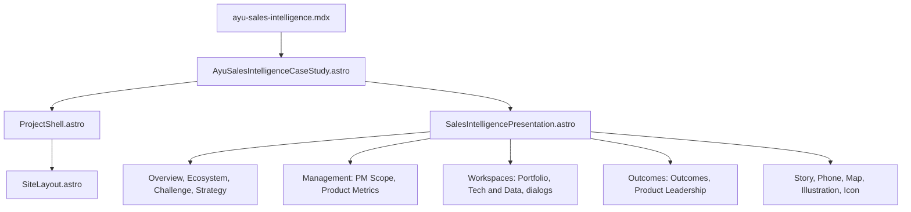

# Ayu Sales Intelligence — implementation and maintenance reference

**Verified:** 10 October 2026. **Source baseline:** `1269e9d` on `main`.  
**Live page:** [Ayu Sales Intelligence & Field Force Optimization](https://mapant.github.io/projects/ayu-sales-intelligence/).  
**Start with:** [Main portfolio and shared architecture](main-portfolio-reference.md).

This guide records the current website implementation, its authored product narrative and its remaining validation limits. It is a maintenance reference, not a redesign specification. This documentation task changed no application source. Earlier visual reports describe earlier worktree states; their “uncommitted” statements do not describe the currently published application.

## 1. Current route, ownership and live state

The project is one statically generated page containing ten sections. Its URL is `/projects/ayu-sales-intelligence/`; section navigation uses fragment anchors. It is not a running sales application, a connected hospital system or a live field-tracking service.

The latest fresh build generated this route successfully. Published HTML returned HTTP 200 and matched the local production HTML by SHA-256. At **1280 × 665 CSS pixels**, all ten section frames measured approximately **1265 × 585.63 pixels**, beneath a **79.36-pixel** sticky header. The available width excludes the ordinary document scrollbar. The route had no broken HTML images, horizontal document overflow or missing section anchors in the fresh check. Initial resource entries contained no cross-origin loads.

These fresh checks cover loading, routing and geometry. They do not establish reference-pixel equality or rerun every dialog interaction. **Native Chrome zoom: NOT VERIFIED.** The previous dedicated visual report still records unresolved photograph, SVG and layout fidelity differences; see section 11.

## 2. Rendering architecture

Astro frontmatter builds local arrays into static HTML. SCSS controls the page and illustration geometry. Inline SVG draws icons, maps and scenes. Plain browser JavaScript in the workspace component opens native HTML dialogs. Shared navigation JavaScript lives in `ProjectShell.astro`. There is no client-side framework hydration or external data request in this project.

## 3. Complete project file and asset map

All paths are relative to the repository root. Shared files are listed to explain dependencies; they are not appropriate targets for a Sales-only visual correction.

| File | Contents and responsibility |
|---|---|
| `src/pages/projects/ayu-sales-intelligence.mdx` | Short MDX route adapter with frontmatter and an imported case-study component; not the main copy store |
| `src/components/AyuSalesIntelligenceCaseStudy.astro` | Shared-shell configuration, ten navigation entries, previous/next project props and project stylesheet imports |
| `src/components/SalesIntelligencePresentation.astro` | Composes all ten sections; directly owns Overview, Ecosystem, Challenge and Strategy; defines their content arrays |
| `src/components/SalesIntelligenceManagement.astro` | PM Scope and Product Metrics markup, responsibility/deliverable arrays and measurement framework |
| `src/components/SalesIntelligenceWorkspaces.astro` | Portfolio and Tech & Data, seven capability records, native detail dialogs and their open/close script |
| `src/components/SalesIntelligenceOutcomes.astro` | Outcomes, Product Leadership, pilot figures, operational/business value, connection link and bottom project navigation |
| `src/components/SalesIntelligenceStory.astro` | Reusable narrative panel: kicker, heading fragments, highlighted text, copy, checks, optional measurement/strategy mini-strip and decorative SVG wave |
| `src/components/SalesIntelligencePhone.astro` | Native phone mockups; `home`, `map`, `prospects` and `field` modes, optional hero presentation, menus and workspace buttons |
| `src/components/SalesIntelligenceMap.astro` | Authored SVG street/map geometry, fixed route/pin coordinates, `field`/`hero` variants; no map SDK |
| `src/components/SalesIntelligenceIllustration.astro` | Named native challenge/strategy illustrations, SVG paths, gradients, filters and decorative details |
| `src/components/SalesIntelligenceIcon.astro` | Project-specific named inline SVG icon paths; supports the visual concepts used across this project |
| `src/styles/ayu-sales-intelligence-case-study.scss` | `.ayu-sales-case` / `.asi-*` layout, palette, card surfaces, phone geometry, portrait sprite crops, illustration sizes, dialogs and responsive rules |
| `src/styles/page-view.scss` | Imported shared desktop frame and fit overrides; some winning styles come from this file rather than Sales SCSS |
| `src/components/ProjectShell.astro` | Shared sticky header, profile, section active-state observer and optional footer |
| `src/styles/project-case-study.scss` | Shared shell and general case-page defaults, imported through `ProjectShell` |
| `src/layouts/SiteLayout.astro` | HTML document and metadata |
| `src/data/portfolio.js` | Main portfolio card/link/summary for this case study; not the source of the detailed Sales sections |
| `public/ayu-sales-intelligence/field-sales-hospital.png` | Overview photograph: field representative outside a hospital |
| `public/ayu-sales-intelligence/ecosystem-portraits.png` | Transparent six-person portrait sprite; CSS chooses the actor crop |
| `public/ayu-sales-intelligence/product-planning-desk.png` | PM Scope planning-desk photograph |
| `public/profile/portrait.jpg` | Default shared header portrait used by this route |
| `docs/ayu-sales-intelligence-validation.md` | Earlier final-fidelity report, per-section results, asset provenance, interaction checks and outstanding differences |

The sprite is a **three-column, two-row** asset, not six separately downloaded photographs. Keep the sprite arrangement and the CSS background-position mapping consistent. Asset URLs begin `/ayu-sales-intelligence/…`; the `public/` prefix never appears in a browser URL.

## 4. Shared shell configuration and route relationships

`AyuSalesIntelligenceCaseStudy.astro` supplies a custom ten-item navigation list in the order below. Its CTA is **View Projects**, linking to `/#portfolio`. Previous is Ayu DocConnect; next is Telecom Analytics & Cost Optimization. `showProjectFooter={false}` suppresses the shared footer because this project renders its own navigation inside the final section. The wrapper does not enable `viewportFitPrototype`; its project-specific classes and imported styles provide the current layout. The default shared JPG profile remains in use.

The final section duplicates the actual previous/home/next links in `SalesIntelligenceOutcomes.astro`. If the project order changes, update **both** the wrapper props and those visible links. Also update the main portfolio’s `products` array and neighboring projects. A new frontmatter title alone does not update the literal `ProjectShell` title.

## 5. Ten-section content, layout and technology map

| Order / anchor | Source owner | Information and visual implementation |
|---|---|---|
| 1 / `#overview` | Presentation | Ayu Health inline SVG branding, literal project headline/lead, local hospital photograph, native hero phone/map and four product-value cards |
| 2 / `#ecosystem` | Presentation | Six actor cards around a central operating model, six sprite crops, role labels, SVG/CSS connectors, supporting-service relationships and bottom strip |
| 3 / `#challenge` | Presentation | Narrative panel, six challenge cards with named native SVG scenes, authored doctor/prospect baseline context and decorative waves |
| 4 / `#strategy` | Presentation | Narrative panel, six numbered strategy cards, native illustrations, arrows/sequence treatment and strategy priorities |
| 5 / `#pm-scope` | Management | Narrative, six responsibility rows, two deliverable groups, local planning photograph, contribution cards and six-step process strip |
| 6 / `#product-metrics` | Management | Field Sales Measurement Framework, six metric groups, Created → Visited → Onboarded → Leads / IPDs / GMV journey and three instrumentation cards |
| 7 / `#portfolio` | Workspaces | Seven capability buttons, two native phone previews and links into seven detail dialogs |
| 8 / `#tech-data` | Workspaces | Five conceptual product architecture layers, native location map, five location-data descriptions and supporting diagram/card content |
| 9 / `#outcomes` | Outcomes | Four manual-pilot results, four operational-impact records, three business-value cards and summary strip |
| 10 / `#product-leadership` | Outcomes | Six leadership capabilities, four themes, connection CTA and previous/home/next navigation |

Each section’s layout is authored for its specific material; it is not a generic repeated template. PM Scope and Portfolio, for example, use three principal columns, while several other sections use a narrative/content split. Preserve those arrangements during a narrow correction.

## 6. Authored data and mapping contracts

There is no project JSON database or CMS. Arrays in component frontmatter are the data source; additional copy remains literal markup. Editing `src/data/portfolio.js` changes the homepage card but does not change these detailed sections.

| Collection / location | Count | Mapping contract |
|---|---:|---|
| `values`, Presentation | 4 | `[tone, icon, title, copy]`; Overview value cards |
| `actors`, Presentation | 6 | `[id, tone, spriteIndex, title, copy]`; actor IDs, portrait positions and connector layout must stay aligned |
| `challenges`, Presentation | 6 | `[tone, illustrationName, title, copy]`; named illustration must exist |
| `strategy`, Presentation | 6 | `[number, tone, illustrationName, title, copy]`; array order is **1, 2, 3, 6, 5, 4**, supporting the existing visual sequence |
| `responsibilities`, Management | 6 | `[tone, icon, title, copy]` |
| Deliverable groups, Management markup | 2 × 5 items | Key Deliverables; Measurement & Rollout |
| PM process, Management markup | 6 | **Frame → Define → Specify → Validate → Enable → Measure** |
| `metrics`, Management | 6 | `[tone, icon, title, [[itemIcon, text], …]]`; three signals per group |
| `capabilities`, Workspaces | 7 | `[id, number, tone, icon, title, description]`; ID links cards, phone controls and dialog IDs |
| `layers`, Workspaces | 5 | `[tone, layerTitle, [[icon, label, supportingText], …]]` |
| `locationData`, Workspaces | 5 | `[tone, icon, title, copy]` |
| `detailLabels`, Workspaces | 7 keyed entries | Must use the same IDs as capabilities and dialog controls |
| `pilot`, Outcomes | 4 | `[tone, icon, number, title, scopeCopy]`; preserve pilot scope and sign |
| `impact`, Outcomes | 4 | Structured planning, priority coverage, reassignment and manager visibility |
| `value`, Outcomes | 3 | Better field time, operational control and informed product decisions |
| `leadership`, Outcomes | 6 | `[tone, icon, title, copy]`; detailed leadership cards |

The six metric groups are **Prospect Quality & Acquisition; Field Coverage; Visit Efficiency; Conversion; Field Productivity; Product Adoption / Usage**. The instrumentation cards say GA / Mixpanel, Live MIS and BDM / City Views. These describe product measurement requirements; they do not instrument the portfolio website.

The actors are doctor/non-doctor prospects, referral agents, BDMs/sales agents, managers/TLs, sales admins and product/business/analytics teams. The six challenge illustration keys are `discovery`, `planning`, `travel`, `reassignment`, `visibility`, `verification`. Strategy keys are `intelligence`, `priority`, `beat-plan`, `optimise`, `allocation`, `territory`. Keep each key’s semantics when changing vector geometry.

## 7. Workspace interaction and ID contract

All seven workspaces are static portfolio demonstrations:

| ID | Capability | Detail element |
|---|---|---|
| `prospects` | Prospect Intelligence & Assignment | `#asi-workspace-prospects` |
| `beat-plan` | Beat Plan & Visit Prioritisation | `#asi-workspace-beat-plan` |
| `visits` | Agent & Prospect Visit Management | `#asi-workspace-visits` |
| `travel` | Location & Travel Intelligence | `#asi-workspace-travel` |
| `agent-movement` | Referral-Agent Movement | `#asi-workspace-agent-movement` |
| `insights` | Sales Insights & MIS | `#asi-workspace-insights` |
| `verification` | Agent Lifecycle & Verification | `#asi-workspace-verification` |

`SalesIntelligenceWorkspaces.astro` binds buttons with `data-asi-workspace` to the matching `HTMLDialogElement` and calls `showModal()`. `data-asi-close` closes the dialog. Clicking outside the dialog rectangle closes it; Escape uses the browser’s native dialog behavior. The dialog does not change the URL hash, fetch records or save changes. The phone menus and bottom controls reuse these same IDs.

Future capability work must update the capability record, dialog body, detail-label map and every relevant phone/card target together. Confirm that all targets exist and that only one dialog is open at a time. Preserve the native dialog semantics and keyboard behavior. The historic report checked all seven opens, focus, Escape/backdrop close and 31 controls; those interaction checks were **not rerun** for this documentation task.

## 8. Technology by visual element and external loading

| Element | Actual implementation | Future modification guidance |
|---|---|---|
| Page and sections | Astro/MDX, semantic HTML | Modify the owning section component, not the generated page |
| Header/profile | Shared `ProjectShell`; local JPG | Shared edits affect other projects and need broader validation |
| Fonts | Segoe UI, Arial, sans-serif; SVG text where authored | No bundled/downloaded font; test wraps on the target OS |
| Colors | Local SCSS variables and tone classes | Adjust the appropriate project tone/surface, not global tokens |
| Cards and spacing | CSS Grid/Flexbox, local padding/gaps/radii/shadows | Inspect the winning rule, including shared fit overrides |
| Project logo | Overview inline Ayu Health SVG plus native phone identity shapes | Not the DocConnect brand component or a downloaded logo |
| Photographs | Three local PNG assets; `` and CSS sprite backgrounds | Preserve legitimate standalone assets and crop independently of UI |
| Icons | `SalesIntelligenceIcon.astro` inline SVG | Extend the named icon map; do not substitute emoji or generic glyphs |
| Large illustrations | `SalesIntelligenceIllustration.astro` paths/gradients/filters | Keep the existing scene slot; change vector details within it |
| Maps | `SalesIntelligenceMap.astro` fixed SVG streets, paths and pins | These are illustrations, not geospatial data or a map service |
| Phone UI | HTML/CSS, SVG icons and static labels | Maintain workspace IDs and approved display wording |
| Connectors / bottom strips | SVG paths and CSS shapes/gradients | Preserve direction, endpoint placement and section composition |
| Details | Native HTML `<dialog>` and plain JS | No server, storage, auth or real operational action |

Principal local tokens are `--asi-blue: #007dff`, `--asi-green: #00b98b`, `--asi-orange: #ff8b00`, `--asi-violet: #8430ff`, `--asi-pink: #ef2381`, `--asi-ink: #05094e`, `--asi-copy: #315189`, `--asi-line: #cee7ff`. They do not exhaust every literal gradient/color in the stylesheet.

There are **no active external photographs, webfonts, map SDKs, GPS calls, Google Analytics/Mixpanel scripts, WhatsApp integrations or product APIs** on this route. “Offline Sales App,” “API-driven Prospect Assignment,” “Maps / Location,” GA / Mixpanel and MIS are authored descriptions of the represented product architecture. The portfolio runs on the Astro stack documented in the main guide; those product names are not package dependencies.

## 9. Frame geometry, CSS cascade and responsive boundaries

The current desktop page occupies available width and the viewport below the sticky header. It does **not** enforce a 16:10 content rectangle at the measured baseline. `page-view.scss` participates in the live route and wins over some lower-specificity Sales defaults. For example, Sales SCSS includes a base `min-height: 560px` / `overflow: visible` rule, but the measured desktop sections use the shared fixed-height, hidden-overflow treatment. A source declaration is not evidence that it wins in the browser.

At the baseline, the principal narrative/content split in Ecosystem, Challenge, Strategy and Metrics was approximately **382.73 / 836.75 pixels**. PM Scope, Portfolio and Tech & Data have distinct three-column proportions. Exact inner widths depend on the ordinary scrollbar, padding and current grid gaps; they are not fixed-canvas dimensions.

The project stylesheet includes a small-screen condition `(max-width: 760px) and (hover: none)`; the shared styles have their own breakpoints. This is not native zoom detection. When changing responsive behavior, inspect all loaded styles and test the actual pointer/viewport conditions. No mobile-wide or native-zoom certification was added in this task.

Do not introduce another frame stylesheet, CSS `zoom`, JavaScript scaling or `transform: scale()` to solve a local fit problem. Existing device/illustration transforms are local visual treatments, not a site scaling system. Section fit and dialog fit are separate checks.

## 10. Efficient future edits and checks

| Change | First file(s) | Required focused verification |
|---|---|---|
| Overview headline or photo crop | Presentation, project SCSS, hospital PNG | Hero subject placement, card/phone alignment and bottom strip at baseline |
| Actor photograph placement | Portrait sprite and actor CSS | All six cells, transparency, index mapping and connector endpoints |
| Challenge / Strategy scene detail | Illustration and Icon | Correct named scene, direction, line thickness and existing card slot |
| PM responsibilities / deliverables | Management | All six rows, two lists, process strip and photo panel |
| Metrics content | Management | All six groups and journey/instrumentation rows; retain approved semantics |
| Add/change workspace | Workspaces and Phone | Seven-ID contract, native keyboard/open/close behavior and detail fit |
| Map geometry | Map | Both variants and every place that imports them |
| Pilot claims | Outcomes and homepage data if intentionally changing both | Preserve pilot population, signs, geography and metric definition |
| Final links | Outcomes, wrapper and neighboring cases | Previous/home/next destinations plus `/#connect` |
| Shared header/frame | Shared files listed above | Broader scope: all four projects and main portfolio |

Begin with an exact text or class search. Change the existing owning rule rather than append another competing override. Save UTF-8 files. Rebuild with `npm.cmd run build`, then inspect the affected section at 1280 × 665 and the surrounding section boundaries. For native dialogs, exercise open, focus, Escape, backdrop and close controls. Run `git diff --check` and inspect the complete changed-file list. A Sales-only task must not silently modify another project, shared frame, dependency manifest or approved content.

SVG gradients/filters use IDs derived from the illustration name or map variant. Reusing the same variant several times can repeat an ID; inspect ID references before introducing additional instances. Keep viewport/viewBox geometry and accessibility labeling deliberate. Do not convert a flattened reference screenshot into UI slices or overlays.

## 11. Historical visual acceptance and challenges

The authoritative existing report is [Sales Intelligence validation](../../docs/ayu-sales-intelligence-validation.md), dated 9 October 2026. It records side-by-side inspection of the ten final references, preservation of approved content/interactions, and passing baseline fit. It explicitly says **strict reference fidelity is not fully passed**.

| Section | Photo / illustration fidelity | Icon / SVG fidelity | Layout fidelity | Content unchanged | Fit unchanged |
|---|---|---|---|---|---|
| Overview | FAIL | FAIL | FAIL | PASS | PASS |
| Ecosystem | FAIL | FAIL | FAIL | PASS | PASS |
| Challenge | FAIL | FAIL | FAIL | PASS | PASS |
| Strategy | FAIL | FAIL | FAIL | PASS | PASS |
| PM Scope | FAIL | FAIL | FAIL | PASS | PASS |
| Product Metrics | PASS | FAIL | FAIL | PASS | PASS |
| Portfolio | FAIL | FAIL | FAIL | PASS | PASS |
| Tech & Data | FAIL | FAIL | FAIL | PASS | PASS |
| Outcomes | PASS | FAIL | FAIL | PASS | PASS |
| Product Leadership | PASS | FAIL | FAIL | PASS | PASS |

These are historical reference-comparison results, not new pixel tests. A photo/illustration PASS in Metrics, Outcomes or Leadership means there was no standalone photograph/large scene to match. A FAIL records a visible difference, not a broken route.

Challenges and lessons retained:

1. Final reference pages were flattened screenshots, without original standalone photographs or editable vectors. Independently generated photographs can approximate composition while still differing in subject identity and pixels. The three PNGs are standalone assets, not UI screenshot crops; provenance is recorded in the report.
2. Native SVG maps/scenes/icons preserve product concepts but still differ in shading, paths, connector bends, line treatments and exact geometry. Pixel fidelity requires a new reference comparison, not only a build.
3. Fonts, wrapping and card density differ from the final references. A Tech & Data headline experiment clipped three lower labels and was reverted during the visual pass; fitting typography must be checked before changing line breaks.
4. The approved baseline and reference screenshots have different content proportions. Preserving the shared header/page fit limits literal screenshot reproduction. Do not reopen shared frame work to hide that fact in a narrowly scoped task.
5. The component split makes editing efficient, but content IDs and phone/dialog controls cross file boundaries. Renaming one capability in isolation breaks the demonstration.

Reference location recorded by the report: `E:\Job Hunt_Mar-June'26\Product Portfolio_Manoj\0.                 New Repo -\Ayu Sales Intelligence`. It is an external specification folder, not a runtime asset path or a portable repository dependency. Consult the designated current final references before a future fidelity correction.

## 12. Numerical context and narrative integrity

The Outcomes section identifies a **Beat Plan manual pilot, two BDMs, Bengaluru**. It reports unique doctor-agent visits **+60% for BDM A**, **+166% for BDM B**; distance travelled per visit **−18% for A**, **−15% for B**. Those are scoped pilot observations, not portfolio-wide percentages, a national rollout result or an implemented website calculation.

Challenge context includes **14,420 doctors** and **85% with no patient lead**, with its authored date/context. That baseline and the two-person pilot are different populations. Neither comes from an external data feed. Homepage card summaries are separately authored. Preserve wording/scope and reconcile differences only through an explicitly approved content change.

“Live MIS,” real-time location and current-location review describe the underlying product story; the website only displays the concept. The portfolio does not query location history, compute distance, validate clinics or reassign actual agents.

## 13. File introduction history and document upkeep

Git history shows the route, case wrapper and project SCSS introduced in `21f53f3` on 6 October 2026. The nine `SalesIntelligence*` components, three photographic PNGs and dedicated validation report were introduced in `57b68cb` on 10 October 2026. These dates describe repository introductions, not proof that every subsequent visual edit occurred in the same step. The root deployment configuration was later published in `1269e9d`.

This guide was created on 10 October 2026 in `docs/references/`. Update it when adding a capability, changing component ownership, replacing an asset, introducing an external service or changing a validation result. Keep the published SHA/date separate from uncommitted documentation and distinguish fresh measurements from historical reference checks. No application files, dependencies, commit or push were changed by this documentation task.
