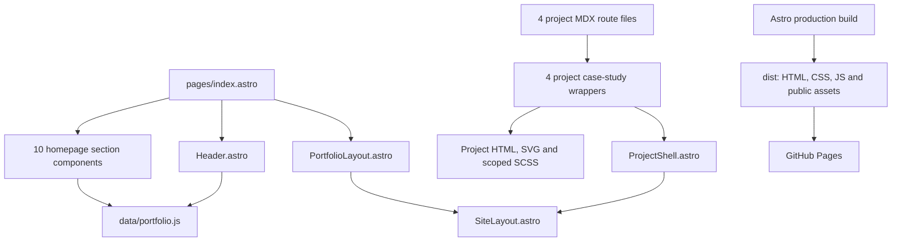

# Main portfolio — architecture, file map and maintenance guide

**Verified:** 10 October 2026. **Source baseline:** commit `1269e9d` on `main`.  
**Live:** [mapant.github.io](https://mapant.github.io/). **Repository:** [mapant/mapant.github.io](https://github.com/mapant/mapant.github.io).  
**Local folder:** `C:\Users\Manoj Pant\GitHub\manoj-product-portfolio`.

This is the starting guide for the whole website. It describes the current implementation, rather than a proposed redesign. All five guides were created for this documentation request; no application code was changed. Repository renaming does not require renaming the local folder.

## 1. Read these guides in sequence

1. This guide: shared architecture, homepage, deployment and adding projects.
2. [Integrated Channels Suite](integrated-channels-reference.md).
3. [Ayu DocConnect](ayu-docconnect-reference.md).
4. [Ayu Sales Intelligence](ayu-sales-intelligence-reference.md).
5. [Telecom Analytics & Cost Optimization](telecom-reference.md).

The five implementation guides live in **`docs/references/`**, alongside the existing reference-image subfolder. Validation and migration reports remain directly in **`docs/`**. All documentation now uses the existing `docs/` directory.

## 2. Current website and verified live state

The website contains **five HTML routes**, not five separate applications. Each route presents ten sections in one scrolling document: **50 sections total**.

| Page | Route | Route source |
|---|---|---|
| Main Portfolio | `/` | `src/pages/index.astro` |
| Integrated Channels Suite | `/projects/integrated-channels/` | `src/pages/projects/integrated-channels.mdx` |
| Ayu DocConnect | `/projects/ayu-docconnect/` | `src/pages/projects/ayu-docconnect.mdx` |
| Ayu Sales Intelligence | `/projects/ayu-sales-intelligence/` | `src/pages/projects/ayu-sales-intelligence.mdx` |
| Telecom Analytics & Cost Optimization | `/projects/telecom-cost-optimization/` | `src/pages/projects/telecom-cost-optimization.mdx` |

Fresh verification for this guide:

- `npm.cmd run build` passed and generated the five routes above.
- All five published routes returned HTTP 200; their HTML SHA-256 hashes matched the fresh local production output.
- Twenty-two unique root-relative asset/link URLs returned HTTP 200. No old `/manoj-product-portfolio/` prefix was found in the checked HTML.
- Headless Chrome at **1280 × 665 CSS pixels** found no broken HTML images, horizontal document overflow or missing section anchor targets on those routes.
- All 50 section frames were measured. Initial page-load resource entries showed **no cross-origin resources** on the five pages.
- The current live application is commit `1269e9d`; writing these guides does not change the deployed application.

These checks establish build, routing, resource loading and frame measurements. They do not certify every text range, every mobile viewport, every interaction or reference-pixel equality. **Native Chrome zoom: NOT VERIFIED.** Existing project reports explicitly retain visual fidelity failures; see the respective project guides.

Older `docs/PROJECT_CONTEXT.md` statements about six routes, AML/Provider Payout pages, repository name, configuration, metrics and a previously clean worktree are historical. The current checkout has no AML or Provider Payout route/component. Existing outcome text can still mention that work; a narrative mention does not create a case-study route.

## 3. Architecture and execution model



Astro evaluates component frontmatter and data imports **at build time**, producing static HTML. MDX files are short route adapters that import their dedicated Astro case-study components; most project copy is not authored in MDX paragraphs. Browser JavaScript handles navigation, email-draft preparation and the two projects' workspace interactions. There is no browser SPA router, React hydration, database, CMS, server-side application, authentication service or implemented product API.

Public asset files are copied to the output unchanged and requested from the site's own origin. Astro compiles SCSS and bundles processed scripts into hashed `/_astro/` files. Generated filenames can change after a source edit: never hardcode those hashes or edit `dist/` as a source of truth.

## 4. Technology mapped to actual website responsibilities

| Responsibility | Implementation and owner | Important distinction |
|---|---|---|
| HTML document and metadata | `src/layouts/SiteLayout.astro`: doctype, language, charset, viewport, shared description, title prop, slot | It does not currently own page-fit CSS |
| Homepage layout adapter | `src/layouts/PortfolioLayout.astro` wraps `SiteLayout` | Small wrapper, not another rendering framework |
| Routes | `src/pages/index.astro` and four `.mdx` files; Astro static generation | File-based URLs; no JavaScript router |
| Project header/navigation/footer | `src/components/ProjectShell.astro` | Shared by all four projects; changing it has a four-route impact |
| Homepage header | `src/components/Header.astro` | Separate markup from `ProjectShell`, with similar visual styling |
| Content | Literal HTML plus local JavaScript arrays/objects | Build-time authored content; no live CMS or metrics fetch |
| Fonts | Active base stack: `"Segoe UI", Arial, sans-serif`; selected SVG text uses Arial; DocConnect decorative handwriting uses system cursive fallbacks | No active webfont download. OS/font availability can alter wrapping |
| Colors and surfaces | SCSS/CSS custom properties plus literal hex colors, gradients, borders, radii and shadows | There is no single complete global design-token file |
| Cards and layout | Semantic HTML with CSS Grid/Flexbox, `minmax`, `clamp`, percentages and container/viewport units | No card/UI component library or Tailwind |
| Diagrams and charts | Inline SVG paths/shapes, HTML nodes, CSS connectors/bars/pseudo-elements | No Chart.js, D3, Mermaid runtime, canvas or embedded BI dashboard |
| Main icons | Existing text glyphs and inline SVG/CSS shapes in section files | Glyph appearance depends on the local font; these are not a downloaded icon font |
| Project icons/logos | Dedicated Astro SVG icon components, inline brand marks; DocConnect embeds four vendor SVGs | Product-specific systems; see each project guide |
| Profile | Local `public/profile/portrait.jpg`; DocConnect overrides to `portrait.png` | A file in `public/` is served as `/profile/...`, not `/public/profile/...` |
| Photographs | Local PNG/JPG files, rendered by `` or CSS backgrounds | CSS crop/position is separate from the image asset |
| Interactions | Plain browser JavaScript, IntersectionObserver, History API, native `<dialog>`, mailto | No backend submission or real product operations |
| Build dependencies | Lockfile: Astro **7.3.5**, `@astrojs/mdx` **8.0.2**, Sass **1.105.1** | `package.json` declares ranges `^7.3.5`, `^8.0.2`, `^1.93.2`; a range is not the installed version |
| Runtime | Package engines `^22.12.0 || ^24.0.0`; inspected local Node **24.21.0** | Deployment workflow pins Node **22.12.0** |
| Hosting | GitHub Actions build/upload followed by GitHub Pages deployment | GitHub Pages serves static files; product stack names in diagrams are not hosting dependencies |

## 5. Shared and repository-level file inventory

Paths below are relative to the repository root. The tables describe tracked source responsibilities, not a claim that every file was created in this documentation task.

| File | Contents and maintenance role |
|---|---|
| `astro.config.mjs` | `site: 'https://mapant.github.io'`, static output, MDX integration, directory format; no subpath `base` |
| `package.json` | Project metadata, Node engine range, `dev`/`build`/`preview` commands and three direct dependencies |
| `package-lock.json` | Exact dependency resolution; retain it and use `npm.cmd ci` for reproducible installation |
| `.github/workflows/deploy.yml` | Push-to-`main` deployment, Pages permissions, build and deploy jobs |
| `.github/workflows/build.yml.bak` | Historical workflow backup; `.bak` is not an active Actions workflow |
| `.gitignore` | Excludes `node_modules`, `dist`, `.astro`, environment files and OS artifacts |
| `README.md` | Currently a minimal repository title, not a comprehensive architecture guide |
| `src/layouts/SiteLayout.astro` | Common HTML/head/body structure and title prop |
| `src/layouts/PortfolioLayout.astro` | Homepage layout wrapper around `SiteLayout` |
| `src/components/Header.astro` | Homepage portrait, identity, section navigation and View Projects CTA |
| `src/components/ProjectShell.astro` | Project props, shared portrait/header, custom/default nav, optional footer and active-section observer |
| `src/pages/index.astro` | Ten-section composition order, `.viewport-fit-prototype` wrapper, homepage style/script imports |
| `src/data/portfolio.js` | Homepage navigation, expertise, card copy, project links, metrics, tech layers, outcomes and connect focus |
| `src/scripts/navigation.js` | Homepage active links using IntersectionObserver, clicks and hash changes; it does not scale the page |
| `src/styles/portfolio.scss` | Homepage base reset, palette, typography, all ten section designs, responsive rules and later overrides |
| `src/styles/page-view.scss` | Active homepage/Sales/Telecom desktop fit overrides, header proportions and dense content arrangements |
| `src/styles/project-case-study.scss` | ProjectShell styles, general `.case-page` defaults, footer and small-screen breakpoints |
| `docs/PROJECT_CONTEXT.md` | Historical requirements/context; several state claims are superseded by current source |
| `docs/ayu-docconnect-validation.md` | Targeted DocConnect correction and fidelity limits from 9 October |
| `docs/ayu-sales-intelligence-validation.md` | Sales visual comparison results, remaining differences and generated-photo provenance |
| `docs/github-pages-root-migration.md` | Root-domain migration, exact config change, repository renames, commit and deployment evidence |
| `docs/references/*.md` | The five current implementation/maintenance guides |
| `public/.gitkeep` | Directory placeholder; no visual/UI role |

### Stored files outside the active route graph

| File | Current status |
|---|---|
| `src/components/CaseStudyPage.astro` | Older generic case-study renderer; not imported by current pages |
| `src/components/ProjectCaseStudyShell.astro` | Older shell using MP initials and `case-study.scss`; not the current `ProjectShell` |
| `src/styles/case-study.scss` | Styles for those older generic components; outside the active route graph |
| `src/styles/reference.scss` | Older visual system, including a Google Inter font import; **not loaded by current routes** |
| `src/styles/responsive-layout.scss` | Older responsive foundation; not imported by current routes |
| `src/scripts/integrated-channels.js` | Older explorer/search/print implementation with different selectors/data; not the active ICS script |
| `src/styles/.portfolio.scss.swp` | Tracked editor swap artifact; not a stylesheet import or implementation authority |
| `public/profile/m2p-logo.svg` | Stored logo file; current ICS branding uses its dedicated inline Astro brand component |

Do not edit an unused file expecting the live page to change. Do not delete historical files merely because this audit found no active import; assess references/history and obtain the required cleanup scope first. `.github/workflows/build.yml` is not currently on disk. Deleted React-era files shown by old Git history are not current architecture.

## 6. Homepage section-by-section map

All ten section components are in `src/components/sections/`; all import their listed data from `src/data/portfolio.js`. Layout/surface rules live in `portfolio.scss` with desktop overrides in `page-view.scss`, except that Portfolio also has scoped CSS inside its component.

| Order / anchor | Component and mapped data | Literal content, visual arrangement and implementation |
|---|---|---|
| 1 / `#overview` | `Overview.astro`; `expertise` (6 entries) | Literal headline/lead, 4 summary stats, 3-column expertise cards; right operating-model nodes, inline SVG connectors, CSS icons/bars |
| 2 / `#ecosystem` | `Ecosystem.astro`; `ecosystemCards` (8) | Narrative/orbit plus business/customer/product/AI/automation/data/operations/compliance cards; HTML nodes and CSS/SVG decoration |
| 3 / `#challenge` | `Challenge.astro`; `challengeCards` (6) | Workflow/integration/decision/automation/data/alignment problem cards and PM responses; CSS grids and existing glyphs |
| 4 / `#strategy` | `Strategy.astro`; `strategySteps` (7) | Frame → Discover → Define → Prioritize → Roadmap → Deliver → Learn & Measure; numbered cards and authored strategy illustration |
| 5 / `#scope` | `PMScope.astro`; `scopeCards` (8) | Discover, Define, Design, Architect, Automate, AI/GenAI, Deliver, Scale & Adopt; descriptions, bullets and outputs in HTML/CSS cards |
| 6 / `#metrics` | `Metrics.astro`; `metricGroups` (6), `metricFormulas` (5) | Literal narrative/chart plus metric framework cards, authored numeric samples and formulas; no calculations against live data |
| 7 / `#portfolio` | `Portfolio.astro`; `products` (4) | Four project cards with CSS device illustrations, problem/ownership/outcome, stats, tags and case-study links |
| 8 / `#tech` | `TechData.astro`; `techLayers` (6) | Product technology model, capabilities, data/source/API/service layers and tools strip; many labels are literal arrays inside this component |
| 9 / `#outcomes` | `Outcomes.astro`; `outcomes` (6) | Outcome values/deltas plus literal impact panels and decorative charts; HTML/CSS, no BI service |
| 10 / `#connect` | `Connect.astro`; `connectFocus` (5) | Local inline SVG desk illustration, inquiry form, social links and availability/location panels; JS counter and mailto handler |

Homepage anchor names **`scope`, `metrics`, `tech`, `connect` differ from project anchor names**. Keep `navItems` and the rendered section IDs synchronized; copying project IDs into homepage navigation will break links.

## 7. Content mapping and hardcoded information

`portfolio.js` exports twelve named data collections: `navItems`, `expertise`, `ecosystemCards`, `challengeCards`, `strategySteps`, `scopeCards`, `metricGroups`, `metricFormulas`, `products`, `techLayers`, `outcomes`, `connectFocus`.

These are local authored data, not remote responses. Each section also contains literal headings, narratives, diagrams, some extra inline arrays, and decorative labels. A wording change may therefore belong in either the data file or the section component. Search the exact text before choosing the file.

The `products` contract is:

| Field | Rendered use |
|---|---|
| `number`, `company`, `title`, `short` | Card identity and header |
| `problem`, `ownership`, `outcome` | Three narrative rows |
| `stats` | Arrays of `[value, label]` for summary numbers |
| `tags` | Domain/capability chips |
| `url` | Actual case-study destination |
| `tint` | CSS theme class, such as `product-blue` |

Homepage summaries and project details are **not automatically synchronized**. Project narratives/metrics live in their own components. When an approved metric or project title changes, check both locations and the previous/next links.

The homepage currently says **10+ years** in its visible Overview. An older context document says 11+; the documentation task does not approve rewriting either. The homepage Outcomes includes **25% telecom operating-cost reduction**, while the Telecom case study describes **15%–20% CapEx/OpEx savings**. Treat these as an existing scope/claim distinction requiring user confirmation, not numbers to silently normalize.

## 8. Assets, external loading and contact behavior

| Resource | Actual behavior |
|---|---|
| Header portrait | ``, served locally |
| Main diagrams/device art/desk scene | Inline SVG, CSS and HTML; no remote photograph/map/chart dependency |
| Site CSS/JS | Same-origin hashed Astro build output |
| Fonts | Local system fonts; the unused Inter import is not an active network request |
| LinkedIn | Opens the literal `https://www.linkedin.com/in/manoj-pant-35129495/` link in a new tab |
| GitHub | Opens `https://github.com/mapant`; no repository API feed is rendered |
| X | Current link is `https://x.com/`, a generic destination, not a confirmed personal profile |
| Contact submit | Builds a subject/body and navigates to `mailto:manoj.pant.pm@outlook.com`; the user's configured mail client must complete sending |

The inquiry form has no server endpoint, inbox integration, delivery confirmation or stored submission. Names/company/email/topic/message are read from `FormData` only to prepare the draft. The message counter displays a 500-character limit. Updating the destination email requires changing the submit handler in `Connect.astro`.

Product diagrams mentioning SQL, PostgreSQL, Python, APIs, Frappe, GA/Mixpanel, maps, WhatsApp, JIRA, Figma, Power BI or Tableau describe professional/product context. Those labels do not mean the portfolio executes those systems or submits data to them.

## 9. Current page geometry and CSS ownership

The current desktop presentation uses full layout width and a sticky header, with one viewport-height composition per section. At the inspected **1280 × 665 CSS viewport**, the homepage header measured **79.36px** and each section **1265 × 585.63px**. The 15px width difference was the browser's vertical scrollbar, not a hardcoded design width.

`page-view.scss` applies the desktop contract at `min-width: 761px`: header height `clamp(72px, 6.2vw, 120px)`, section height `calc(100dvh - var(--header-h))`, `aspect-ratio: auto`, `overflow: hidden`. Its later rules rearrange dense cards to fit. `portfolio.scss` also has 860px/560px breakpoints, and `Portfolio.astro` has 1150px/860px grid breakpoints. The overlap is significant: do not infer behavior from a single media rule.

**The live baseline is not an enforced 16:10 rectangle.** Earlier 16:10 defaults/comments and prior proposed page-fit approaches are not a substitute for computed styles. There is currently no `src/styles/page-frame.scss` in this checkout. No JavaScript page scaling or CSS `zoom` is used. Some project illustrations rotate/translate locally; those transforms are not a global page scaler.

For a change: inspect the winning computed rule, ancestor container and matching breakpoint; adjust the owning existing selector. A new broad stylesheet or unscoped override can affect unrelated routes. Do not assume that smaller viewports automatically make every section scrollable: fixed-height/hidden-overflow rules and older responsive rules can compete. Validate the requested viewport after any layout or copy expansion.

## 10. Safely add another project

1. Obtain approved project wording, outcomes, standalone assets, reference composition and route slug. Do not invent missing product evidence.
2. Create `src/pages/projects/<slug>.mdx` using the existing route-adapter pattern: frontmatter, an import of the new Astro component and one component invocation.
3. Create a dedicated case-study component/presentation and a scoped stylesheet. Use `ProjectShell` with matching `navSections`, title, CTA, previous/next links and intentional footer behavior. Keep its internal design distinct from existing projects.
4. Store legitimate assets under `public/<slug>/`; use root-relative paths such as `/<slug>/hero.png` (for example `/new-project/hero.png`). Preserve attribution/licensing. Do not use reference screenshot UI as an asset.
5. Add one complete `products` entry to `portfolio.js`; map its `url` to the real MDX route and its `tint` to an implemented theme.
6. Update the literal **“Four representative product case studies”** text in `Portfolio.astro`. Its four-column desktop grid, row height and density need an explicit design decision for a fifth card; appending data alone does not guarantee a fitted page.
7. Extend the current index-based illustration/icon mapping in `Portfolio.astro`: `art-${i + 1}`, its small glyph array and matching `portfolio.scss` rules. Prefer a deliberate keyed mapping when expansion is approved; do not leave a new card without defined art/theme behavior.
8. Update the previous/next project ring in all affected wrappers **and** any separately authored final-section navigation. Current order is Integrated → DocConnect → Sales → Telecom → Integrated.
9. Keep `/#portfolio`, `/#connect` and `/` return links correct. A new project does not automatically require a new homepage section/header tab; those tabs navigate the ten homepage sections.
10. Check homepage metric/outcome mentions only where the approved requirement affects them. For example, “4 industry ecosystems” is not automatically a project count.
11. Build, inspect the new route, every anchor, card/phone/diagram, asset request and keyboard interaction. Recheck all five existing pages after any shared-file modification. Update this index and add a project reference guide.
12. Review the diff and follow the user's commit/push boundary. A push to `main` triggers a live deployment.

Example route pattern, adapted from the current repository:

```mdx
---
title: "Approved Project Title"
company: "APPROVED COMPANY"
---
import NewProjectCaseStudy from '../../components/NewProjectCaseStudy.astro';

<NewProjectCaseStudy />
```

Changing only MDX frontmatter does not automatically update the literal title passed to `ProjectShell`, homepage cards or navigation captions.

## 11. Efficient modification and troubleshooting map

| Required change / symptom | Start here | Verification |
|---|---|---|
| Homepage card copy/metric | `portfolio.js`; then consuming section | Compare approved text and related project summary |
| Homepage heading or diagram label | Exact text search in `sections/*.astro` | Check wrapping and section boundary at baseline |
| Main profile image | `Header.astro` and `/profile/portrait.jpg` | Check object crop, local URL and browser cache |
| One project fix | Its guide and scoped component/style | Avoid shared edits unless the bug is shared |
| Header misalignment across projects | `ProjectShell`, `project-case-study.scss`, route overrides | Check all four projects and homepage separately |
| Text cut off after enlargement | Winning row sizing, `min-height`, overflow and breakpoint | Check lower rows, not merely HTTP/build success |
| Wrong old case study on live site | Repository identity, root deployment and URL/base config | Confirm commit/run and compare live HTML to `dist` |
| Page unchanged after edit | Active import graph, correct local folder/server, generated bundle and deployed commit | Do not edit a legacy similarly named file |
| Missing vendor icon | Correct SVG component name and local/inline asset | Inspect console/request, not only the colored icon container |
| Contact does not send | `Connect.astro` mailto handler and local mail-client setup | No backend exists; do not promise delivery |
| New card missing artwork | `products`, index/key art mapping and scoped CSS | Render the added card and test its route |

## 12. Challenges encountered and lessons retained

- **Competing old and new repositories:** root-relative links opened old root content while the new homepage lived under a subpath. The root migration removed the subpath setting and verified repository IDs before pushing.
- **CSS layers and inherited defaults:** generic 16:10 rules, viewport overrides and project-specific later declarations can disagree. The fix location must follow the actual loaded route and winning selector.
- **Dense authored content:** a successful build or hidden overflow does not establish that the entire composition is visible. Check section/card boundaries, heading gaps and lower rows before changing wording or font size.
- **Source and visual authority:** references were flattened images/PDFs rather than editable photo/vector sources. Independent reconstruction cannot establish identical original pixels. Existing DocConnect/Sales reports retain explicit failures.
- **External logo failures:** DocConnect previously had failing external logo requests; the current rendering embeds those vendor SVGs locally. Preserve the license and do not reintroduce CDN dependencies casually.
- **Duplicated mappings and stale notes:** homepage summaries, project arrays, footer links and older reports can diverge. Search all occurrences; distinguish historical status from current source.
- **CI Node version:** deployment was corrected to Node 22.12.0, consistent with the package engine floor. Avoid assuming the local Node version is also the workflow version.
- **Windows command wrappers:** use `npm.cmd` in PowerShell; there is no need to alter execution policy to run the repository's npm scripts.

## 13. Development, validation and deployment sequence

From the repository root:

```powershell
git status --short --branch
npm.cmd ci
npm.cmd run dev
```

Use `npm.cmd ci` when dependencies need installing, not for every content edit. Dev normally serves port 4321, but check terminal output if another server uses that port. Save source files before evaluating a changed build.

```powershell
npm.cmd run build
npm.cmd run preview
git diff --check
git diff --name-status
git status --short
```

Preview is a local production-output check; it does not publish. Inspect the ten sections of the changed route at 1280 × 665 and at relevant smaller widths. Test anchors, active navigation, images, lower-row text and project links. For shared changes, check all routes. Browser-viewport emulation must not be reported as native browser zoom validation.

The existing `deploy.yml` uses `actions/checkout@v4`, `withastro/action@v2` with Node 22.12.0 and `actions/deploy-pages@v4`. It runs on pushes to `main`. Stage only reviewed files and commit/push only within the user's current authorization; this documentation request does **not** authorize a push. After an authorized release, verify the Actions run's head commit, live route status, assets and content. Build success alone is not release verification.

Root migration evidence: [commit 1269e9d](https://github.com/mapant/mapant.github.io/commit/1269e9ddf639fea2c5236af4fd7885d50b869f6b), [successful deployment run 37994412272](https://github.com/mapant/mapant.github.io/actions/runs/37994412272), and [migration report](../../docs/github-pages-root-migration.md). The old repository is retained as `mapant.github.io-backup-2026-10-10`; its Pages shutdown was not verified by that task.

## 14. File history and document upkeep

Git history records the current homepage structure/data/ten section files in `f86c5df` (30 September), the PDF-based homepage recreation in `dffd0aa` (1 October), project shell/case-study designs in `21f53f3` (6 October), active `page-view.scss` in `e9f1f1f` (6 October), later project-specific work in the four project guides, deployment workflow in `eaa6c61`, and root routing in `1269e9d` (10 October). Old history also contains removed React-era files; their presence in Git history does not make them active.

After future approved work, update the affected guide's verification date, commit, file/data maps, asset provenance, known limits and validation evidence. Preserve earlier reports as dated history. Do not turn a historical FAIL into PASS without performing the corresponding check. These guides and the migration report are saved locally and remain uncommitted until explicitly included in a later release.
