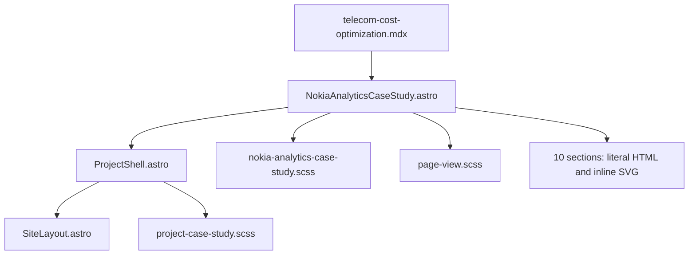

# Telecom Analytics & Cost Optimization — implementation and maintenance reference

**Verified:** 10 October 2026. **Source baseline:** `1269e9d` on `main`.  
**Live page:** [Telecom Analytics & Cost Optimization](https://mapant.github.io/projects/telecom-cost-optimization/).  
**Start with:** [Main portfolio and shared architecture](main-portfolio-reference.md).

This guide describes the existing Nokia/Telecom case study, source ownership, diagrams and maintenance boundaries. The website illustrates an analytics product; it is not the analytics system itself. This documentation task changed no application code, dependencies or approved narrative.

## 1. Current state and route identity

The public title is **Telecom Analytics & Cost Optimization**. The component and stylesheet retain the internal **Nokia** names. Keep this mapping in mind when searching: the route is not `/projects/nokia/`.

The project is a static page containing ten anchored sections at `/projects/telecom-cost-optimization/`. The fresh production build passed. Published HTML returned HTTP 200 and its SHA-256 matched the local build. At **1280 × 665 CSS pixels**, all ten section frames measured approximately **1265 × 585.63 pixels**, below a **79.36-pixel** sticky header. The available width excludes the ordinary document scrollbar. The fresh check found no broken HTML images, horizontal document overflow or missing section anchors. Initial resource entries contained no cross-origin requests.

Those checks establish loading, routing and frame geometry. They are not a visual overlay against a Telecom reference, an all-text clipping audit, a mobile certification or proof of real analytics operations. **Native Chrome zoom: NOT VERIFIED.** No dedicated current ten-reference Telecom fidelity report exists in this checkout; do not infer pixel-perfect acceptance from a build.

## 2. Architecture and complete file map

| File | Contents and maintenance role |
|---|---|
| `src/pages/projects/telecom-cost-optimization.mdx` | Short route adapter with title/company frontmatter and imported case-study component |
| `src/components/NokiaAnalyticsCaseStudy.astro` | All ten sections, literal approved narratives, supplied result range, cards, labels, inline SVG maps/connectors and shared-shell props |
| `src/styles/nokia-analytics-case-study.scss` | `.nokia-case` tokens; maps, source/consumer columns, strategy matrix, semantic board, architecture, rollout, command-centre preview, impact and trust model; small-screen rules |
| `src/styles/page-view.scss` | Imported shared desktop sizing/fit overrides, including Product Explorer adjustments |
| `src/components/ProjectShell.astro` | Shared portrait/header, default section navigation, active state, previous/home/next footer |
| `src/styles/project-case-study.scss` | Shared case-page defaults, header/footer styling and responsive rules |
| `src/layouts/SiteLayout.astro` | HTML document, metadata, title and slot |
| `src/data/portfolio.js` | Main portfolio product-card summary, route and separately authored outcome summaries |
| `public/profile/portrait.jpg` | Default shared portfolio portrait used by this project |
| Historical page-fit notes from earlier task context | The earlier `docs/page-fit-validation.md` report is not present in this checkout; its described frame system is not the current implementation |
| `docs/PROJECT_CONTEXT.md` | Older repository context; some route/geometry/state statements are stale |

There is no Nokia-specific data file, image folder, icon component, client script or external stylesheet import. All project diagrams are native markup, inline SVG and CSS in the two dedicated files. A Nokia company label appears in the Overview kicker; this route does not load a separate Nokia logo photograph/SVG asset.

The component is compact because much of its HTML is on long lines. The project SCSS similarly contains a small number of very long rule lines. Line count does not indicate a small design. Use exact class/text searches and bounded edits; avoid broad replacements or unrelated formatting changes that obscure the intended fix.

## 3. Shell configuration and navigation contracts

`NokiaAnalyticsCaseStudy.astro` imports `ProjectShell` and supplies the page title plus previous/next project props. It uses the shell defaults:

- Default ten-item navigation: Overview, Ecosystem, Challenge, Strategy, PM Scope, Architecture, Delivery, Product Explorer, Impact, Product Leadership.
- Default CTA **Portfolio**, linking to `/`.
- Default profile `/profile/portrait.jpg`.
- Shared project footer enabled.
- `viewportFitPrototype` not enabled.

Previous project is Ayu Sales Intelligence & Field Force Optimization; next is Integrated Channels Suite. The shell generates this project's footer rather than a footer authored inside the final section. To change project order, update these props, the main `products` array and adjacent projects’ links. The header/nav structure is shared: do not alter it during a Telecom-only visual task.

Unlike DocConnect/Sales/Integrated Channels, this project has anchors `#architecture`, `#delivery`, `#product-explorer`, `#impact`, `#leadership`; it has no `#product-metrics`, `#tech-data` or `#product-leadership`. Preserve this route-specific mapping. A similarly named section on another project is not evidence that the same hash works here.

## 4. Ten-section information and implementation map

All rows below are rendered by `NokiaAnalyticsCaseStudy.astro`; their matching local rules are in `nokia-analytics-case-study.scss`, with some fit overrides in `page-view.scss`.

| Order / anchor | Approved section heading | Information, visual and layout |
|---|---|---|
| 1 / `#overview` | “Connect where the network is with what it costs.” | Two-column narrative/map. Asset identity + geography + cost context thesis; native network-visibility SVG and legend; supplied 15%–20% result strip |
| 2 / `#ecosystem` | “Join network activity, finance and place.” | Five source-domain cards → converging SVG paths → asset/spatial/cost core → branching paths → three decision-user cards |
| 3 / `#challenge` | “The asset existed; the decision context did not.” | Isolated field/rollout/finance/map records, missing stable join, visibility consequences and native before/after decision-context composition |
| 4 / `#strategy` | “Trust the join before trusting the insight.” | Four-quadrant Identity/Join/Measure/Drill matrix with axis labels; separate executive-to-action decision ladder |
| 5 / `#pm-scope` | “Define the semantic layer users can make decisions with.” | Discover/Define/Model/Deliver rail, five data-contract questions and Engineering ↔ Field Operations ↔ Finance ↔ Analytics/Data stakeholder bar |
| 6 / `#architecture` | “Converge independent domains through an asset-centred model.” | Four domain sources; ingestion/validation/freshness connector; identity/spatial/measure model; three consumers and four quality labels |
| 7 / `#delivery` | “Roll out insight at the level teams act.” | Site validation, regional deployment/cost comparison, enterprise capital efficiency; readiness/feedback conditions and rollout visual |
| 8 / `#product-explorer` | “A spatial cost-intelligence command centre.” | Static dashboard-like interface, four executive signal cards, display-only filter labels, authored SVG map/legend and cost-driver bars |
| 9 / `#impact` | “Asset visibility turns disconnected records into cost action.” | Supplied savings card; Integrate → Locate → Understand → Optimise chain and result-integrity text |
| 10 / `#leadership` | “Analytics trust depends on what users cannot see.” | Four-layer trust pyramid; Now/Next/Future analytics maturity roadmap; quality/freshness/spatial/governance context |

Each section has its own numbered `.case-page-foot` strip. These strips, headings and diagrams are project content, distinct from the shared portfolio header/footer. Retain section order, IDs, numbering and the text associated with each connector.

## 5. Content storage, mappings and authored examples

There is no project-specific content schema or external data loader. The main component's HTML is the authoritative detailed content store. Each card/label is literal markup. The MDX frontmatter supplies route metadata but does not replace the literal title passed to `ProjectShell`. Homepage project summaries are independently stored in `src/data/portfolio.js`.

Important cross-section conceptual mappings:

| Concept | Where it appears | What must remain consistent |
|---|---|---|
| Asset identity | Overview thesis; Ecosystem core; Strategy; Architecture | The central join key, not an isolated geographic marker |
| Geography/location | Map illustrations; source domains; spatial join; command centre | Authored spatial context; not a live coordinate dataset |
| Finance / CapEx / OpEx | Sources, measure layer, explorer, result | Period/asset/cost meaning and supplied range |
| Engineering / field / finance users | Ecosystem and PM Scope | Distinct decision roles using a shared model |
| Freshness / coverage / governance | Architecture quality labels and Leadership pyramid | Required trust concepts; not implemented monitoring endpoints |
| Source → model → decision | Ecosystem, Architecture, Impact | Arrow order and meaning of convergence/fan-out |
| Now → Next → Future | Leadership roadmap | Trusted periodic reporting, near-real-time visibility, predictive planning as maturity stages |

The command-centre preview's bar lengths, marker positions and cards are authored visual examples. They are not computed from supplied raw network/finance files. The source contains no ingestion pipeline, spatial join function, SQL query, BI model, filter engine or report export. Changing a CSS width changes the illustration, not a business calculation.

**Region, Period and Asset Class are display labels in spans, not functional filter controls.** Their presence should not be documented as an implemented interactive dashboard feature. The page's real interactions are shared section navigation and route links.

## 6. Technology by page element

| Element / responsibility | Actual website stack and file | Interpretation and future-edit boundary |
|---|---|---|
| Route and rendering | Astro + MDX, route adapter and case component | Static HTML generation; no client SPA router |
| Document/meta | `SiteLayout.astro` | Shared across routes |
| Header/profile/nav/footer | `ProjectShell.astro`, shared case SCSS, local JPG | Broader impact if changed |
| Typography | Segoe UI, Arial, sans-serif; inherited shared base plus local font rules | System fonts; exact wrapping depends on platform/font availability |
| Palette | `.nokia-case` CSS variables and local literal colors | Project-specific blue/teal/green surfaces |
| Cards/panels | HTML, CSS Grid/Flexbox, local borders/radii/shadows | No UI component library |
| Source connectors / architecture | Inline SVG paths, HTML nodes and CSS arrows | Check endpoint order, line styles and spacing together |
| Overview / explorer maps | Native SVG shapes, paths, markers and labels | Authored schematic maps; no Google Maps, Mapbox, Leaflet or GIS service |
| Dashboard bars / metric strips | HTML/CSS widths and labels | Illustrative authored values, not a chart library or live calculation |
| Strategy matrix / trust pyramid | HTML cards plus CSS positioning/geometry | Native code; no image of a finished reference page |
| Company identity | Literal Nokia Networks / Telecom Analytics label | No externally hosted brand asset |
| Photos | Shared header portrait only | No Telecom-specific photo recreation dependency |
| Browser behavior | Shared plain JavaScript active-section observer and normal links | No Telecom-specific dialog/detail application |
| Hosting | Astro static build → GitHub Actions → GitHub Pages | See main guide for pinned build versions and root deployment |

The local palette starts with `--nok: #1875a8`, `--nok-deep: #103d62`, `--nok-teal: #08a997`, `--nok-green: #65a847`, `--nok-line: #c9ddeb`, `--nok-soft: #eef7fb`. Additional gradients and diagram-specific colors are literal rules. This is not a single complete site-wide token source.

The PM Scope rail mentions SQL needs and Power BI / Tableau. The Architecture represents operations, telemetry, finance, geography, ingestion, conformed models and analytical consumers. These are **the represented product stack/concepts**. They are not JavaScript dependencies or connected services in this portfolio. There is no embedded BI dashboard, telemetry collector, database connection, API credential, map account, analytics tracking script or external font load on this route.

## 7. Current frame, stylesheet ownership and responsiveness

The baseline desktop page uses available width and viewport height below a sticky header. The measured content frame is **not 16:10** at 1280 × 665. General shared case styles contain other width/aspect/minimum defaults; route and `page-view.scss` overrides determine the current computed geometry. There is no current `src/styles/page-frame.scss` file. The historical page-fit notes supplied in earlier task context describe a previous implementation and must not be copied as current CSS truth.

`page-view.scss` is active on this route. It includes dense-layout overrides for the Product Explorer: a constrained command body, grid-based spatial panel, fitting SVG height and typography adjustments. A correction to explorer clipping may therefore require inspecting both local `.analytics-command` rules and shared `page-view` rules. Identify the winning declaration first; do not add a second frame system.

At desktop, measured sections use hidden overflow. That means a section can have correct outer geometry while an internal label still clips; a build or frame measurement alone does not prove every card is readable. Check all bottom strips and explorer labels after typography/content changes.

The local stylesheet contains max-width 760px and 480px rearrangements. Several compound grids become single-column. Product Explorer also has larger small-screen minimum-height declarations (including 800/1200px treatments); verify their interaction with the shared section-height rules on the actual target viewport. This guide does not certify all mobile states.

Preserve browser-native scrolling and zoom. There is no need to add JavaScript scaling, CSS `zoom`, `transform: scale()` or a fixed 1920 × 1200 canvas for a local correction. Section fit, shared footer placement and small-screen content flow must be checked separately.

## 8. Supplied outcomes and current consistency limitation

Overview and Impact show **15%–20% CapEx / OpEx savings via asset visibility optimisation**, explicitly labeled a supplied project result. Impact also says not to turn the range into a single-point estimate without confirming scope and measurement basis. Preserve that qualification.

The main portfolio product card also describes a 15%–20% result, while a separate homepage Outcomes item states **25% operating cost reduction**. These are independently authored statements and currently differ. This documentation task did not resolve or rewrite them. Any future content reconciliation needs an approved source, definition and scope; do not silently normalize one value while fixing layout.

The Challenge section's “multi-million-dollar inefficiencies” is narrative context, not a newly calculated or audited amount. No dataset or underlying calculation is shipped. The authored savings/result statements are not evidence that the static website runs those analyses.

## 9. Efficient future changes and troubleshooting

| Task | First place to inspect | Verification |
|---|---|---|
| Change approved narrative or labels | Exact text in `NokiaAnalyticsCaseStudy.astro` | Correct section, preserved scope, baseline wraps and bottom strip |
| Adjust a section grid/card | Matching class in local Nokia SCSS | Current computed style, full diagram and adjacent spacing |
| Fix source/consumer arrows | Inline SVG path plus local connector width | Correct convergence/fan-out and endpoint alignment |
| Adjust map markers/lines | Inline SVG in Overview or Product Explorer | Both map instances, viewBox/aspect fit, legend correspondence |
| Change illustrative bars | Literal CSS widths/markup | State clearly that these are examples; preserve approved values |
| Fix Product Explorer fit | Local command/spatial rules and imported `page-view.scss` | Every row, marker, legend, filter label and lower cost panel |
| Adjust small-screen flow | Local media rules plus shared case/frame rules | Mobile height, overflow, footer and stacked order |
| Change previous/next | Case wrapper props, adjacent projects, main data | Shared footer destinations and root return link |
| Add real analytics/filter behavior | Separate approved feature scope first | Data contract, safe sample data, UI state and actual interaction tests |
| Change shared header or frame | Shared files | All four projects plus the main portfolio |

Recommended sequence:

1. Read this guide and the relevant current reference/specification. Determine whether the request concerns authored content, a native illustration or actual website behavior.
2. Search for the exact heading/class. Make a bounded edit to the owning component or existing rule. Long source lines make blind replacements risky.
3. Preserve all ten section IDs and the shared shell contract. Keep schematic meaning, arrow direction, numbering and supplied result qualifications intact.
4. Run `npm.cmd run build`. Inspect the changed section and nearby boundaries at 1280 × 665. Check all lower labels; inspect small-screen behavior when the change affects responsive rules.
5. Run `git diff --check`, `git status --short` and `git diff --name-status`. Review the complete diff; do not modify other project/shared files during a Telecom-only task.
6. Record what was actually checked. Build/geometry PASS, visual comparison PASS and analytical validity are different claims.

Do not edit generated `dist/` files, introduce image screenshots as dashboard UI or treat a display-only span as an interactive filter. If adding another diagram instance, check SVG IDs/references for collisions and maintain accessible labels where the diagram conveys information.

## 10. Challenges and lessons for maintainers

- **Different names across layers:** Telecom route/title vs Nokia source names can make searches miss the correct file. Use the file map rather than create a duplicate component.
- **Dense source and visuals:** Long HTML/SCSS lines hide substantial layout complexity. Restrict edits to the relevant block and verify bottom content at the baseline.
- **Competing geometry defaults:** Shared case defaults and `page-view.scss` route overrides have different intentions. The browser's computed layout is the current authority for diagnosing overflow.
- **Conceptual analytics versus running features:** Native maps, dashboard strips and static filters demonstrate architecture but do not execute it. Avoid promising functionality that the source does not implement.
- **Outcome scope:** Preserve the supplied range and distinguish it from independently authored homepage claims. Layout work must not rewrite results.
- **Historical reports:** Older frame notes and missing-route statements are useful history, not current acceptance. The fresh build has five routes and the live root deployment works.

No new visual correction was attempted during documentation. The fresh checks did not compare Telecom pixels with an external final reference; future visual acceptance requires that explicit comparison and a recorded result.

## 11. History, deployment and document upkeep

Git history records the Telecom MDX route introduced in `f86c5df` on 30 September 2026. `NokiaAnalyticsCaseStudy.astro` and `nokia-analytics-case-study.scss` were introduced in `21f53f3` on 6 October 2026. The shared `page-view.scss` history begins at `e9f1f1f` on 6 October 2026. Those are introduction records, not a claim that the current file equals its first version.

Current hosting is the root repository `mapant/mapant.github.io` with `site: 'https://mapant.github.io'` and no subpath `base`. Root-relative case and asset links now resolve to the new portfolio. The local checkout folder still has its original name. Build/remote/workflow details and the old-repository backup strategy are covered in [Main portfolio](main-portfolio-reference.md) and [migration report](../../docs/github-pages-root-migration.md).

This guide was created on 10 October 2026 in `docs/references/`. Update it if content moves into a data file, diagrams move to dedicated components, actual filters/external services are introduced, route order changes or validation is extended. Keep fresh checks, historical results and planned product maturity separate. No application code, dependencies, commit or push were changed by this documentation task.
